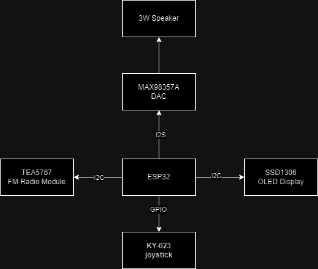
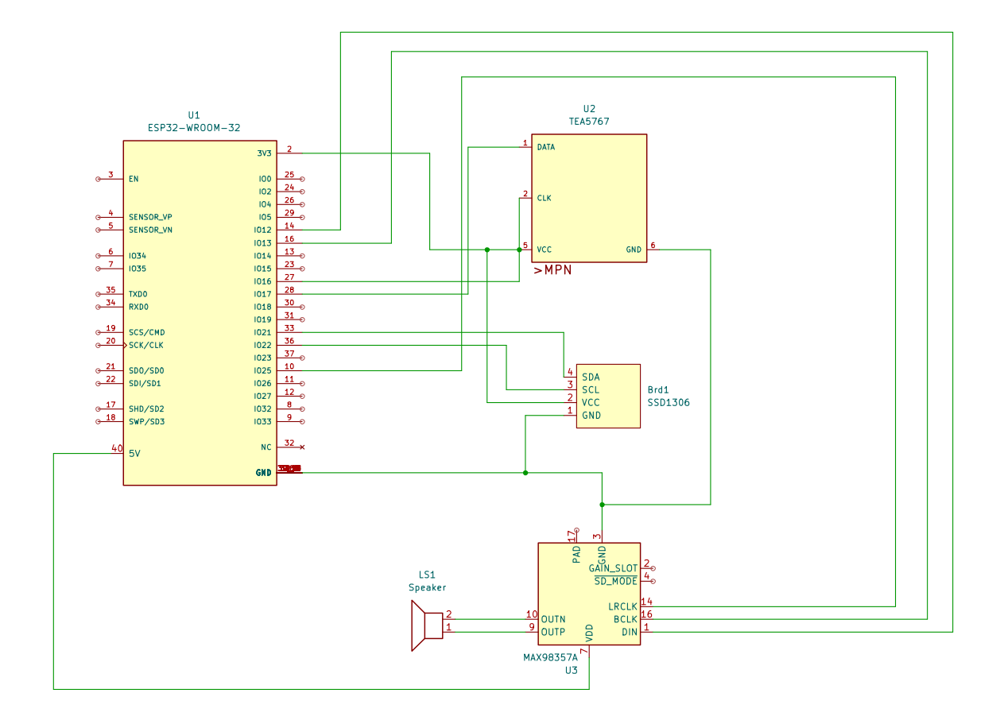

# ESP32 FM Radio

### What is the purpose of the project
This project aims to use an ESP32 board to listen to FM radio stations and play music via the board's integrated Bluetooth module. It also features a sleek GUI on an OLED display!

### The idea
I’ve seen many radios at rural market stalls and wanted to create my own to see if I could make something better.

### Why I think this project is useful
I want to learn and create something I can use at home. Hopefully, others will also find it useful for their own projects.

### Functions
1. Core functionality
- FM Radio player
- Use as an external Bluetooth speaker

2. GUI
- Search for FM channels and save them
- Visual volume control
- Signal strength meter (for Radio, Wi-Fi and Bluetooth)
- Wi-Fi settings and network status
- Bluetooth settings and status
- System debug information (RAM, CPU, etc.)
- Web interface for remote control

## Block Diagram

## Electrical Schematic

## Hardware Design
- 1x Espressiff ESP-WROOM-32 with ESP32 Chip ([eMAG Link](https://www.emag.ro/placa-esp32-cu-esp-wroom-32-38-pini-cu-cip-cp2102-multicolor-esp32-cp2102/pd/D7R798MBM/)) ([Datasheet](https://www.espressif.com/sites/default/files/documentation/esp32-wroom-32_datasheet_en.pdf))
    - Allows for Wi-Fi and Bluetooth connectivity and all the processing power needed for the project.
- 1x TEA5767 (I2C) ([Aliexpress Link](https://www.aliexpress.com/item/32968805755.html?channel=twinner))
     - Used for FM Radio Capabilities
     - Wiring:
        - SDA -> GPIO17
        - SCL -> GPIO16
        - VCC -> 3.3V
- 1x SSD1306 OLED Screen Board (I2C) ([Aliexpress Link](https://www.aliexpress.com/item/1005007614149117.html?channel=twinner))
    - For displaying the GUI and information about the radio station or song.
    - Wiring:
        - SDA -> GPIO21
        - SCL -> GPIO22
        - VCC -> 3.3V
- 1x MAX98357A amplifier with 3W Speaker (I2S) ([Aliexpress Link](https://www.aliexpress.com/item/1005007138041962.html?channel=twinner))
    - For playing the audio from the radio or Bluetooth.
    - Wiring:
        - DIN -> GPIO12
        - BCLK -> GPIO13
        - LRC -> GPIO25
        - GAIN -> GPIO14
        - SD -> GPIO33
        - VCC -> 5V
- Multiple cables
- 3x 10kΩ resistors
- 3x buttons for media control

## Software Design
For this project I used PlatformIO IDE.
 
The code is written in C++ and uses the Arduino framework.

### Libraries
- TEA5767 library for FM radio
- Adafruit SSD1306 for OLED display control
- Adafruit GFX for graphics
- ESP32-A2DP for Bluetooth audio
- ArduinoJson for parsing JSON data
- ESPASyncWebServer for handling web requests
- base64 for encoding and decoding data
- freeRTOS for multitasking